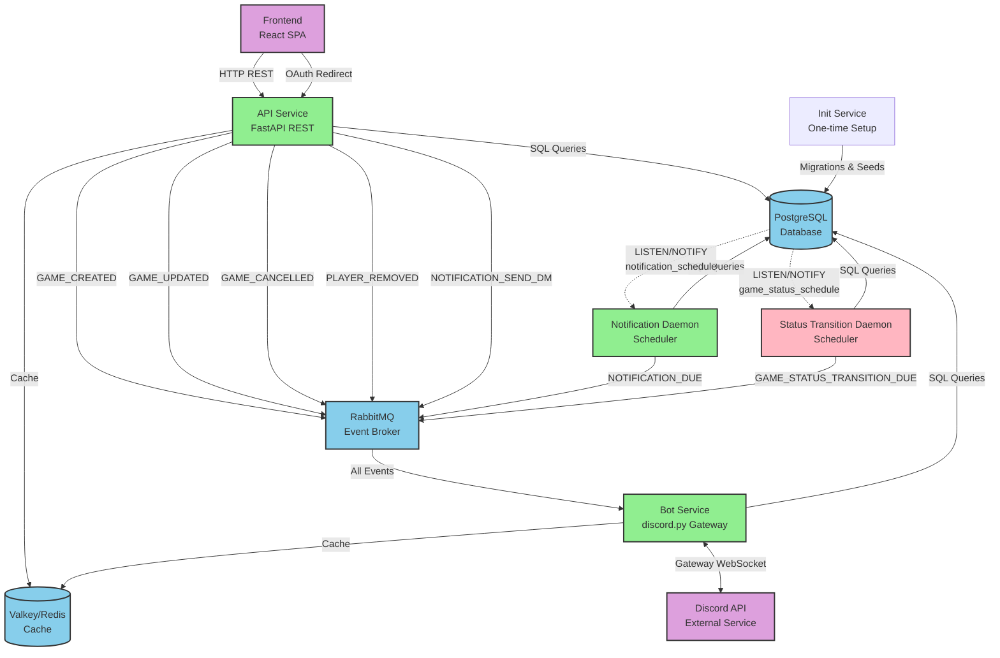
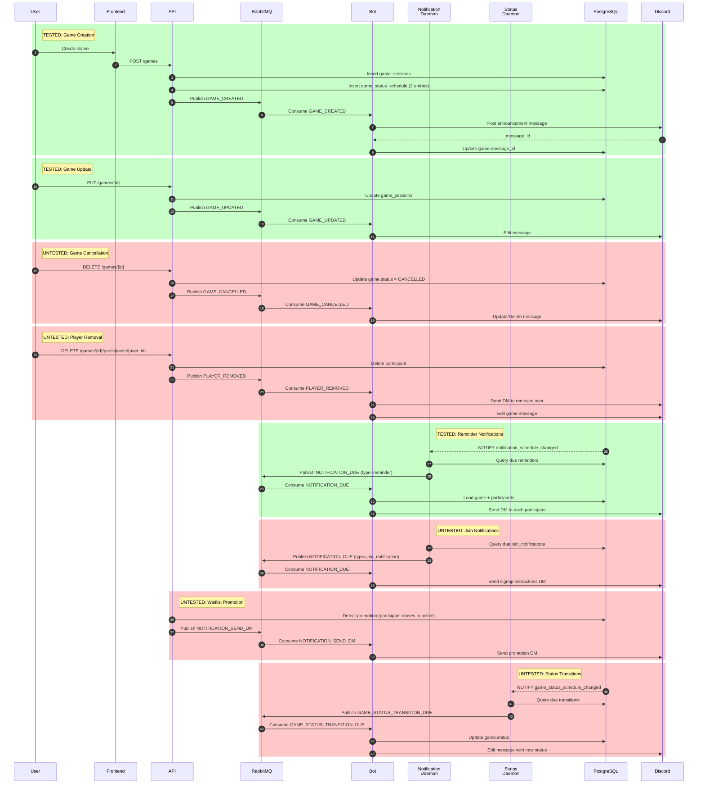
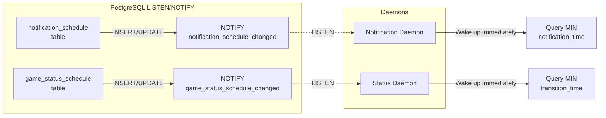

# Microservice Communication Architecture

## System Architecture Diagram

## Event Communication Paths

## Event Type Reference

### API Service Events (Immediate)

| Event Type | Trigger | Bot Action | E2E Test Status |
|------------|---------|------------|-----------------|
| `GAME_CREATED` | POST /games | Post announcement to channel | ✅ Tested |
| `GAME_UPDATED` | PUT /games/{id} | Edit Discord message | ✅ Tested |
| `GAME_CANCELLED` | DELETE /games/{id} | Update/delete message | ❌ Not tested |
| `PLAYER_REMOVED` | DELETE /games/{id}/participants | Send DM + update message | ❌ Not tested |
| `NOTIFICATION_SEND_DM` | Waitlist promotion | Send promotion DM | ❌ Not tested |

### Notification Daemon Events (Scheduled)

| Event Type | Trigger | Bot Action | E2E Test Status |
|------------|---------|------------|-----------------|
| `NOTIFICATION_DUE` (reminder) | Game reminder time reached | Send DM to all participants | ✅ Tested |
| `NOTIFICATION_DUE` (join_notification) | Delayed join notification | Send signup instructions DM | ❌ Not tested |

### Status Transition Daemon Events (Scheduled)

| Event Type | Trigger | Bot Action | E2E Test Status |
|------------|---------|------------|-----------------|
| `GAME_STATUS_TRANSITION_DUE` | scheduled_at or completion time | Update status + edit message | ❌ Not tested |

## Database Trigger Patterns

## Test Coverage Summary

**Pattern 1: Immediate API Events** - 2/5 tested (40%)
- ✅ GAME_CREATED
- ✅ GAME_UPDATED
- ❌ GAME_CANCELLED
- ❌ PLAYER_REMOVED
- ❌ NOTIFICATION_SEND_DM

**Pattern 2: Scheduled Notification Events** - 1/2 tested (50%)
- ✅ NOTIFICATION_DUE (type=reminder)
- ❌ NOTIFICATION_DUE (type=join_notification)

**Pattern 3: Scheduled Status Events** - 0/1 tested (0%)
- ❌ GAME_STATUS_TRANSITION_DUE

**Overall E2E Coverage**: 3/8 critical paths tested (37.5%)

## Missing Test Files (Recommended)

1. `tests/e2e/test_game_cancellation.py` - Game cancellation flow
2. `tests/e2e/test_player_removal.py` - Player removal DM flow
3. `tests/e2e/test_waitlist_promotion.py` - Waitlist promotion DM flow
4. `tests/e2e/test_join_notification.py` - Delayed join notification flow
5. `tests/e2e/test_game_status_transitions.py` - Status transition daemon flow
